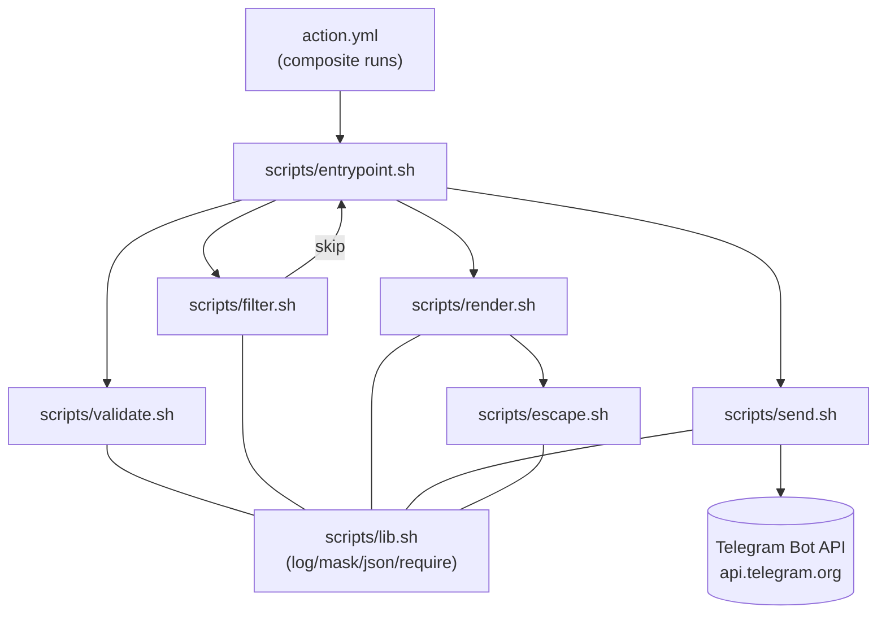

<!-- generated: 2026-05-27, template: core.md -->

# Architecture

## 1. Overview

`notiflow` is a **composite GitHub Action** that posts a Telegram message when a workflow job completes. It follows a **linear pipeline architecture**: the composite manifest delegates to a single bash entry point that orchestrates five stateless modules (validate → filter → render → send), each sourced as a library function rather than executed as a child process.

```
                        ┌──────────────────────────────────────────────┐
   Transport            │ action.yml                                   │
   (GitHub Actions)     │   inputs (15) → env NF_* → composite step    │
                        └────────────────────┬─────────────────────────┘
                                             │ bash "$action_path/scripts/entrypoint.sh"
                                             ▼
                        ┌──────────────────────────────────────────────┐
   Orchestration        │ scripts/entrypoint.sh                        │
                        │   require_bash → require_cmd(curl,jq) →      │
                        │   mask → validate → filter → render → send   │
                        └────────────────────┬─────────────────────────┘
                                             │ source (no subprocess)
        ┌────────────────────────────────────┼───────────────────────────────┐
        ▼                ▼                   ▼                ▼              ▼
   ┌─────────┐    ┌──────────┐         ┌──────────┐    ┌──────────┐   ┌──────────┐
   │validate │    │  filter  │         │  render  │───►│  escape  │   │   send   │
   │   .sh   │    │   .sh    │         │   .sh    │    │   .sh    │   │   .sh    │
   └────┬────┘    └─────┬────┘         └─────┬────┘    └─────┬────┘   └────┬─────┘
        │ exit 10–15    │ skip rc=1          │ stdout text   │              │ HTTP POST
        ▼               ▼                    ▼               ▼              ▼
   ┌───────────────────────────────────────────────────────────┐    ┌──────────────┐
   │ scripts/lib.sh (log, mask, set_output, json_escape,       │    │ Telegram Bot │
   │                require_command, require_bash)             │    │ sendMessage  │
   └───────────────────────────────────────────────────────────┘    └──────────────┘
```

Arrows show **invocation direction**. All modules are sourced once into a single bash process; there is no IPC. `lib.sh` is the common substrate every other module depends on.

## 2. Component Deep Dive

### 2.1 Transport Layer — `action.yml`

Composite-action manifest. Declares inputs, outputs, branding, and a single composite step that executes `scripts/entrypoint.sh`.

| File | Description |
|------|-------------|
| `action.yml` | 15 inputs (`bot_token`, `chat_id`, `status`, `parse_mode`, `notify_on`, `message`, `message_template`, `template_<status>`, `disable_web_page_preview`, `disable_notification`, `message_thread_id`, `fail_on_error`); 3 outputs (`ok`, `message_id`, `http_status`); `runs.using: composite` (`action.yml:81`); single `bash` step that env-maps `INPUT_*` to `NF_*` (`action.yml:85-100`). |

**Role.** Sole public contract surface. Mapping `inputs.<x>` → `env.NF_<X>` (lines 85–100) is the input-boundary convention every downstream script relies on (`NF_*`).

### 2.2 Orchestration Layer — `scripts/entrypoint.sh`

The orchestrator. Sources all five library modules and drives the pipeline.

| File | Description |
|------|-------------|
| `scripts/entrypoint.sh` | `set -euo pipefail` (`entrypoint.sh:5`); sources `lib.sh`/`validate.sh`/`filter.sh`/`escape.sh`/`render.sh`/`send.sh` (`entrypoint.sh:9-19`); calls `nf::require_bash`, `nf::require_command curl`, `nf::require_command jq` (`entrypoint.sh:21-23`); masks token before any other observable action (`entrypoint.sh:27-29`); invokes `nf::validate` → `nf::should_notify` → `nf::render` → `nf::send`; maps `nf::send` return to exit code based on `NF_FAIL_ON_ERROR` (`entrypoint.sh:47-56`). |

**Role.** Sequencing and exit-code policy. Contains no business logic — every concrete step delegates to an `nf::*` function defined elsewhere.

### 2.3 Domain / Library Layer — `scripts/*.sh`

Five library modules. Each is **source-only** (no shebang), idempotent (`_NF_<NAME>_LOADED` guard), and exposes one or more `nf::*` public functions plus `_nf::_*` private helpers.

| File | Description |
|------|-------------|
| `scripts/lib.sh` | Common helpers shared by every module: `nf::log <level> <msg>` emits GitHub workflow commands to stderr (`lib.sh:11-22`); `nf::mask <value>` prints `::add-mask::<value>` (`lib.sh:26-28`); `nf::set_output <key> <value>` appends to `$GITHUB_OUTPUT` (`lib.sh:32-35`); `nf::json_escape <value>` uses `jq -Rs .` (`lib.sh:39-41`); `nf::require_command <cmd>` exits 22 if missing (`lib.sh:45-50`); `nf::require_bash` enforces bash ≥ 3.2 with re-exec fallback to `/opt/homebrew/bin/bash` or `/usr/local/bin/bash` (`lib.sh:55-67`). |
| `scripts/validate.sh` | `nf::validate` checks every `NF_*` input. Exit codes `10` (`MISSING_REQUIRED_INPUT`), `11` (`INVALID_CHAT_ID`), `12` (`INVALID_STATUS`), `13` (`INVALID_PARSE_MODE`), `14` (`INVALID_NOTIFY_ON`), `15` (`INVALID_THREAD_ID`) — see `validate.sh:8-14`. `chat_id` regex accepts `@username` (4–32 chars), negative integer, or non-negative integer (`validate.sh:33-53`). Defaults are filled in here: `NF_STATUS` falls back to `JOB_STATUS` (`validate.sh:56-58`); `NF_PARSE_MODE=MarkdownV2` (`validate.sh:66-68`); `NF_NOTIFY_ON=success,failure,cancelled` (`validate.sh:76-78`). |
| `scripts/filter.sh` | `nf::should_notify <status> <notify_on_csv>` returns 0/1 by splitting CSV on commas with a temporary `IFS` and trimming whitespace per item (`filter.sh:10-23`). No dependencies beyond bash builtins. |
| `scripts/escape.sh` | Three pure escape functions, dispatched by `parse_mode`: `nf::escape_md_v2` escapes backslash first, then the MarkdownV2 specials `_*[]()~``>#+-=\|{}.!` via `sed` character class (`escape.sh:11-17`); `nf::escape_html` escapes `&<>` in that order (`escape.sh:21-26`); `nf::escape_none` is identity (`escape.sh:30-32`). |
| `scripts/render.sh` | `nf::render` selects the template (priority: `NF_MESSAGE` → `NF_TEMPLATE_<STATUS>` → `NF_MESSAGE_TEMPLATE` → built-in default at `render.sh:48-56`), substitutes 16 known placeholders via `sed` iteration (`render.sh:108-114`), warns and strips unknown ones (`render.sh:117-127`), and truncates the result to 4096 bytes with `…` suffix (`render.sh:134-142`). Bash 3.2-compatible: no associative arrays — uses a space-separated key list `_NF_PLACEHOLDER_KEYS` (`render.sh:9`) plus a `case` dispatcher `_nf::_placeholder_value` (`render.sh:23-46`). |
| `scripts/send.sh` | `nf::send <text>` builds JSON via `jq -n --arg/--argjson` (`send.sh:36-54`), POSTs via `curl -sS -w '\n%{http_code}'` (`send.sh:62-67`), then runs a retry loop bounded by `_NF_MAX_ATTEMPTS=4` (`send.sh:8`, `send.sh:83-147`). Branches on HTTP status: 200/ok → set outputs and return 0; 429 → sleep `parameters.retry_after // 1`; 5xx → exponential backoff `1<<(attempt-1)` (1s/2s/4s); curl exit ≠ 0 (status 0) → backoff like 5xx; 4xx → set ok=false and return 1 immediately; on exhaustion → set ok=false and return 1. |

### 2.4 Infrastructure Layer — Telegram Bot API

External HTTPS dependency.

| Endpoint | Description |
|----------|-------------|
| `POST {NF_API_BASE}/bot<bot_token>/sendMessage` | Default `NF_API_BASE=https://api.telegram.org` (`send.sh:60`). The base is overridable for tests — `tests/helpers.bash:59` points it at a local mock server. JSON body shape: see `.spec/DOMAIN.md` §1. |

### 2.5 Test / Verification Layer — `tests/`

bats-core test suites plus a Python HTTP mock that captures requests and returns canned responses.

| File | Description |
|------|-------------|
| `tests/lib.bats` | Unit tests for `nf::log`, `nf::mask`, `nf::set_output`, `nf::json_escape`. |
| `tests/validate.bats` | All six exit codes (10–15) exercised. |
| `tests/filter.bats` | `nf::should_notify` positive/negative cases. |
| `tests/escape.bats` | MarkdownV2/HTML/none correctness across the 18-symbol special set. |
| `tests/render.bats` | Template priority, placeholder substitution, unknown-placeholder warning, 4096 truncation. |
| `tests/send.bats` | 200 success, 429 with `retry_after`, 5xx with backoff, 400 no-retry — via the mock. |
| `tests/entrypoint.bats` | End-to-end pipeline including skip-by-filter outputs and `fail_on_error` semantics. |
| `tests/helpers.bash` | `setup_clean_env` (resets `NF_*` and seeds `GITHUB_*`), `mock_telegram_start` / `mock_telegram_stop`, `read_output` / `assert_output_eq`, `count_mock_requests`, `last_mock_body`. |
| `tests/fixtures/mock_server.py` | Python HTTP server: replays a comma-separated `--responses` script (e.g. `429:rate_limit,200:success`) and logs every request to `--log`. |

## 3. Directory Structure

```
notiflow/
├── action.yml                      # Composite action manifest (inputs/outputs/runs)
├── scripts/                        # Bash pipeline modules
│   ├── entrypoint.sh               # Orchestrator (the only file with a shebang + set -euo pipefail)
│   ├── lib.sh                      # log/mask/set_output/json_escape/require_*
│   ├── validate.sh                 # nf::validate; exit codes 10–15
│   ├── filter.sh                   # nf::should_notify
│   ├── escape.sh                   # nf::escape_md_v2 / _html / _none
│   ├── render.sh                   # nf::render + placeholder dispatcher
│   └── send.sh                     # nf::send + retry loop
├── tests/                          # bats-core tests + Python mock
│   ├── *.bats                      # One file per scripts/*.sh module
│   ├── helpers.bash                # Shared setup, mock control, output assertions
│   └── fixtures/
│       └── mock_server.py          # Programmable Telegram mock
├── .github/workflows/
│   ├── ci.yml                      # Matrix lint+test on ubuntu-latest and macos-latest
│   └── release.yml                 # Moves the v1 major tag to the latest release
├── .spec/                          # Spec-driven-dev artifacts
│   ├── ARCHITECTURE.md             # ← this file
│   ├── PACKAGES.md                 # Module reference
│   ├── CODE_STYLE.md               # Bash conventions
│   └── features/
│       └── telegram-notify-action/ # Feature spec (requirements, design, etc.)
├── Makefile                        # lint / test / build / install-tools targets
├── README.md                       # User-facing documentation
├── LICENSE                         # MIT
└── CHANGELOG.md
```

## 4. Key Design Decisions

The seven ADRs in `.spec/features/telegram-notify-action/design.md` §2.4 are the authoritative record. The five most architecturally significant are recapped here.

1. **Composite action over Docker/JS (ADR-1).** Zero cold-start, runs on `ubuntu`/`macos`/`windows` runners, no `dist/` bundle to maintain, no GHCR publish. Cost: only `bash` + `curl` + `jq` may be assumed; `entrypoint.sh` therefore re-exec's into a newer bash if it finds itself in 3.2 (`lib.sh:55-67`).

2. **Linear pipeline of `source`-only modules.** `entrypoint.sh` is the only file with a shebang; every `scripts/<x>.sh` is a sourced library with an `_NF_<NAME>_LOADED` guard (e.g. `lib.sh:5-6`). Benefits: a single process means a single audit boundary for the token, function-level unit testing via bats `load` (`tests/helpers.bash` is loaded by every bats suite), and no IPC.

3. **Custom retry loop instead of `curl --retry` (ADR-3).** Telegram returns `retry_after` in the **JSON body** (`parameters.retry_after`), not the `Retry-After` header. `curl --retry` cannot read it. `send.sh:111-118` parses the body with `jq` and `sleep`s the indicated seconds; 5xx uses exponential backoff `1 << (attempt-1)` at `send.sh:121`. Total attempt cap: `_NF_MAX_ATTEMPTS=4` (`send.sh:8`).

4. **`fail_on_error` defaults to `false` (ADR-5).** Notification failure must not mask the underlying job result. The entrypoint maps `nf::send`'s non-zero return to `exit 1` only when `NF_FAIL_ON_ERROR` is `true|TRUE|True|1|yes`; otherwise it logs a warning and exits 0 (`entrypoint.sh:47-56`).

5. **Bash 3.2 compatibility (revised from ADR-4).** macOS system bash is 3.2 and the codebase commits to that floor. `render.sh` avoids `declare -A`: a space-separated `_NF_PLACEHOLDER_KEYS` list (`render.sh:9`) drives a `case` dispatcher (`render.sh:23-46`). The version gate in `lib.sh:55-67` only enforces `>= 3` and falls back to Homebrew bash when below.

6. **Template selection has a fixed four-level priority.** `NF_MESSAGE` (verbatim, no substitution, no escape) > `NF_TEMPLATE_<STATUS>` > `NF_MESSAGE_TEMPLATE` > built-in default. Encoded in `render.sh:98-103` for the message-passthrough and `render.sh:61-79` for the template picker. Conflict resolution rule from `.spec/features/telegram-notify-action/requirements.md` §Conflict-Priority.

7. **Escape per-value, never per-template (REQ-5.6 / ADR-6).** Only placeholder values are escaped; user-supplied templates are honoured verbatim so authors can include their own Markdown syntax. The escape is dispatched by `_nf::_escape_value` (`render.sh:81-88`) which picks one of three pure functions in `escape.sh`.

## 5. Data Flow

```
GitHub Actions step
  uses: jtprogru/notiflow@v1
    │   inputs: bot_token, chat_id, status, ...
    ▼
action.yml (runs.using: composite)
  │   maps inputs.<x>  →  env NF_<X>     (action.yml:85-100)
  │   shell: bash
  ▼
scripts/entrypoint.sh
  │   set -euo pipefail; NF_HOME=<scripts dir>
  │   source lib.sh, validate.sh, filter.sh, escape.sh, render.sh, send.sh
  │
  ├─► nf::require_bash               (lib.sh:55)   — re-exec into bash>=3 if needed
  ├─► nf::require_command curl       (lib.sh:45)   — exit 22 if missing
  ├─► nf::require_command jq         (lib.sh:45)
  ├─► nf::mask "$NF_BOT_TOKEN"       (lib.sh:26)   — first observable side effect
  ├─► nf::validate                   (validate.sh:25)
  │     ├── token/chat_id presence  → exit 10
  │     ├── chat_id regex           → exit 11
  │     ├── status set & in-set     → exit 12
  │     ├── parse_mode in-set       → exit 13
  │     ├── notify_on each in-set   → exit 14
  │     └── thread_id integer       → exit 15
  │
  ├─► nf::should_notify $NF_STATUS $NF_NOTIFY_ON      (filter.sh:10)
  │     └── rc=1 → set outputs ok=false, message_id="", http_status=0; exit 0
  │
  ├─► text=$(nf::render)                              (render.sh:98)
  │     ├── if NF_MESSAGE set → return it (truncated to 4096)
  │     ├── _nf::_pick_template      (render.sh:61)   — priority: per-status → message_template → default
  │     ├── for each of 16 placeholder keys:
  │     │     value     = _nf::_placeholder_value KEY    (render.sh:23)
  │     │     escaped   = _nf::_escape_value VALUE       (render.sh:81 → escape.sh)
  │     │     rhs       = _nf::_sed_rhs_escape ESCAPED   (render.sh:94)
  │     │     template  = sed "s/{{\.KEY}}/RHS/g"        (render.sh:113)
  │     ├── warn + strip remaining {{.Unknown}}
  │     └── truncate to 4096 bytes with "..." suffix
  │
  └─► nf::send "$text"                                (send.sh:73)
        ├── json = _nf::_build_json "$text"           (send.sh:14, via jq -n)
        ├── loop attempt = 1..4:
        │     raw  = curl POST … <<< "$json"          (send.sh:62)
        │     http = last line of raw; body = rest
        │     switch http:
        │       200 & body.ok==true → set outputs (ok=true, message_id, http_status=200); return 0
        │       429                 → sleep body.parameters.retry_after (default 1); continue
        │       5xx                 → sleep 1<<(attempt-1); continue
        │       0 (network err)     → sleep 1<<(attempt-1); continue
        │       4xx (other)         → set outputs (ok=false, message_id="", http_status); return 1
        └── exhausted → set outputs (ok=false, …); return 1

entrypoint.sh exit-code policy (entrypoint.sh:47-56):
   nf::send rc=0                        → exit 0
   nf::send rc=1 && NF_FAIL_ON_ERROR=true→ exit 1 ("SEND_FAILED")
   nf::send rc=1 && otherwise            → log ::warning::; exit 0
```

The diagram below mirrors `.spec/features/telegram-notify-action/design.md` §2.2, adapted for the documentation context (every box represents code that exists on disk today).


