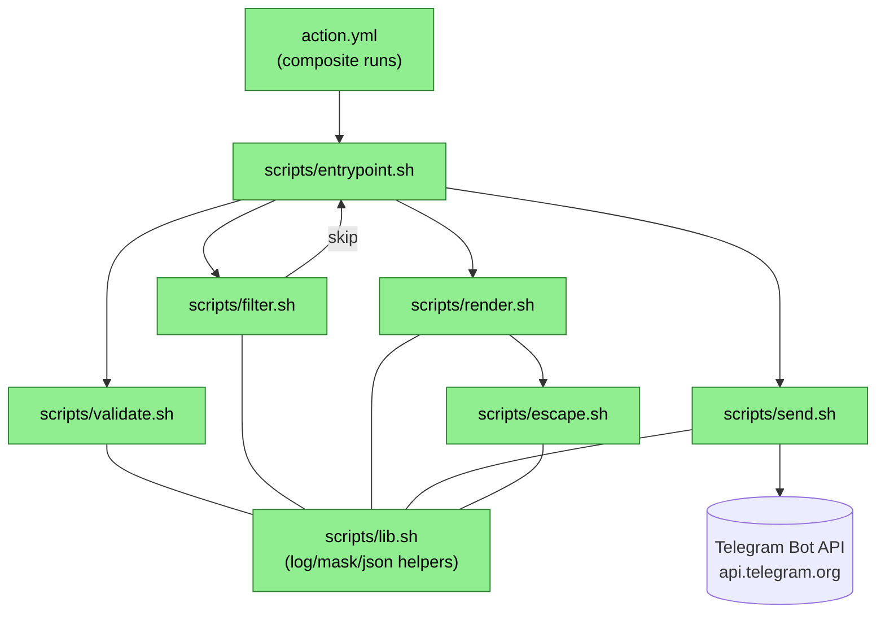

# Telegram Notify Action (`notiflow`) — Design

**Status:** Draft
**Date:** 2026-05-26

## 2.1 Overview

`notiflow` реализуется как composite GitHub Action. Корневой `action.yml` объявляет inputs/outputs/branding и запускает единый bash-вход `scripts/entrypoint.sh`, который последовательно вызывает четыре функциональных модуля:

1. **validate** — проверка inputs, маскирование токена.
2. **filter** — решение «отправлять или нет» по `notify_on` vs текущему статусу.
3. **render** — построение текста сообщения из шаблонов и плейсхолдеров с экранированием по `parse_mode`.
4. **send** — HTTP POST к Telegram Bot API с retry-логикой.

Логически задача делится на три независимых блока, которые можно реализовать параллельно после первичной разводки скелета: (a) шаблонизатор + escape, (b) HTTP/retry-слой, (c) валидация + filter.

## 2.2 Architecture



**Implementation order:**

1. `lib.sh` + `validate.sh` (общая инфраструктура, ничего наружу не вызывает).
2. `escape.sh` (чистая функция, юнит-тестируется изолированно).
3. `render.sh` (зависит от `escape.sh` и `lib.sh`).
4. `filter.sh` (короткий, зависит только от `lib.sh`).
5. `send.sh` (зависит от `lib.sh`, требует mock-сервера Telegram в тестах).
6. `entrypoint.sh` + `action.yml` (склейка).
7. `Makefile` + CI workflow + README.

## 2.3 Components and Interfaces

### Files Requiring Changes

| File | Change Type | Description |
|------|-------------|-------------|
| `action.yml` | `[NEW]` | Manifest action-а: inputs (`bot_token`, `chat_id`, `status`, `parse_mode`, `notify_on`, `message`, `message_template`, `template_success`, `template_failure`, `template_cancelled`, `template_skipped`, `disable_web_page_preview`, `disable_notification`, `message_thread_id`, `fail_on_error`), outputs (`ok`, `message_id`, `http_status`), `runs.using: composite`, единственный шаг `run: bash ${{ github.action_path }}/scripts/entrypoint.sh`, branding (icon `send`, color `blue`). |
| `scripts/entrypoint.sh` | `[NEW]` | Точка входа: устанавливает `set -euo pipefail`, экспортирует inputs в env (`INPUT_*` → `NF_*`), последовательно вызывает validate → filter → render → send. Пишет outputs через `GITHUB_OUTPUT`. |
| `scripts/lib.sh` | `[NEW]` | Общие функции: `nf::log info\|warn\|error msg`, `nf::mask value`, `nf::json_escape value`, `nf::require_command cmd`, `nf::set_output key value`. Source-ится остальными скриптами. |
| `scripts/validate.sh` | `[NEW]` | Функция `nf::validate`: проверяет обязательные `bot_token`/`chat_id`, нормализует `status` (default `${{ job.status }}`), проверяет диапазоны `parse_mode`/`notify_on`/`status`/`message_thread_id`/`chat_id`. Возвращает коды ошибок `MISSING_REQUIRED_INPUT` / `INVALID_*`. |
| `scripts/filter.sh` | `[NEW]` | Функция `nf::should_notify`: возвращает 0, если статус входит в `notify_on`, иначе 1. При skip — пишет лог `notiflow: skipping (<status> not in notify_on)` и завершает entrypoint exit 0 с выставленными outputs (`ok=false`, `http_status=0`). |
| `scripts/escape.sh` | `[NEW]` | Чистые функции: `nf::escape_md_v2 text`, `nf::escape_html text`, `nf::escape_none text` (no-op). MarkdownV2 экранирует `_*[]()~``>#+-=\|{}.!` через `sed -E 's/([_*\[\]()~`>#+\-=\|{}.!])/\\\\&/g'`. HTML экранирует `<>&` через последовательный `sed`. |
| `scripts/render.sh` | `[NEW]` | Функция `nf::render`: выбирает шаблон (`message` → return as-is; иначе `template_<status>` → `message_template` → встроенный default). Собирает map плейсхолдеров (`Repo`, `Workflow`, ..., см. REQ-5.4), эскейпит **только значения** соответствующей функцией из `escape.sh`, последовательно подставляет в шаблон через `sed` (с учётом байт-безопасности — значения проходят через `printf %q`-аналог). Применяет truncate до 4096. |
| `scripts/send.sh` | `[NEW]` | Функция `nf::send`: формирует JSON через `jq -n --arg ... --argjson ...`, выполняет `curl -sS -w '\n%{http_code}' -X POST -H 'Content-Type: application/json' --data @- "https://api.telegram.org/bot${TOKEN}/sendMessage"`. Парсит ответ: при `http=200 && ok==true` — выставляет outputs; при 429 — читает `parameters.retry_after` через `jq` и повторяет; при 5xx — экспонента; до 3 попыток. |
| `tests/escape.bats` | `[NEW]` | Bats-тесты для `nf::escape_md_v2`, `nf::escape_html`, `nf::escape_none`. |
| `tests/render.bats` | `[NEW]` | Bats-тесты для `nf::render`: приоритеты шаблонов, плейсхолдеры, truncate, unknown placeholder, escape интеграция. |
| `tests/validate.bats` | `[NEW]` | Bats-тесты на все коды ошибок валидации. |
| `tests/filter.bats` | `[NEW]` | Bats-тесты для `nf::should_notify`. |
| `tests/send.bats` | `[NEW]` | Bats-тесты для `nf::send`: успех, 429 c retry_after, 5xx с экспонентой, 400 без retry. Использует локальный mock-сервер на `python3 -m http.server` + ответы из fixture, либо `socat`-stub. |
| `tests/fixtures/` | `[NEW]` | Заготовки ответов Telegram (success.json, rate_limit.json, server_error.json, bad_request.json). |
| `tests/helpers.bash` | `[NEW]` | Общие хелперы для bats (запуск mock-сервера, очистка env, утилиты ассерций). |
| `Makefile` | `[NEW]` | Цели `test`, `lint`, `build` (no-op), `readme` (опционально), `install-tools`. |
| `.github/workflows/ci.yml` | `[NEW]` | Matrix CI: `ubuntu-latest`, `macos-latest`. Шаги: install bats/shellcheck/shfmt/actionlint → `make lint` → `make test` → smoke test (запуск самого action-а с тестовым ботом, если секреты доступны — иначе пропуск). |
| `.github/workflows/release.yml` | `[NEW]` | По push тега `v*` — переключает мажорный тег (`v1`) на новый коммит через `actions/checkout` + `git tag -f`. |
| `.gitignore` | `[NEW]` | Стандартный для bash/CI проектов: `*.log`, `tmp/`, `.bats-tmp/`. |
| `README.md` | `[NEW]` | Документация: установка, inputs/outputs (таблица), примеры (минимальный, кастомный шаблон, фильтр по статусу, форум-чат), пиннинг версий. |
| `LICENSE` | `[NEW]` | MIT. |

### Files NOT Requiring Changes

| File | Reason Unchanged |
|------|-----------------|
| `.serena/project.yml` | Serena-конфигурация репозитория, к функциональности action не относится. |
| `.serena/project.local.yml` | Локальная Serena-конфигурация конкретной машины. |
| `.serena/memories/` | Memory-каталог Serena, не часть продукта. |
| `.git/` | Git-метаданные. |

### Interfaces

```bash
# scripts/lib.sh
nf::log <level> <msg>           # level: info|warn|error; пишет в stderr + GH ::notice/::warning/::error
nf::mask <value>                # печатает ::add-mask::<value>
nf::set_output <key> <value>    # appends "key=value" to $GITHUB_OUTPUT
nf::json_escape <value>         # экранирует строку для безопасной подстановки в JSON (использует jq -Rs .)
nf::require_command <cmd>       # exit 1 if command not found

# scripts/validate.sh
nf::validate                    # читает env NF_*; на ошибке: nf::log error + exit 1 с уникальным кодом
                                # exit codes: 10=MISSING_REQUIRED_INPUT, 11=INVALID_CHAT_ID, 12=INVALID_STATUS,
                                #             13=INVALID_PARSE_MODE, 14=INVALID_NOTIFY_ON, 15=INVALID_THREAD_ID

# scripts/filter.sh
nf::should_notify <status> <notify_on_csv>   # rc=0 если notify; rc=1 если skip

# scripts/escape.sh
nf::escape_md_v2 <text>         # stdout: экранированный текст
nf::escape_html <text>
nf::escape_none <text>

# scripts/render.sh
nf::render                      # читает env NF_*; печатает итоговый текст в stdout
                                # внутри вызывает выбор шаблона + подстановку плейсхолдеров

# scripts/send.sh
nf::send <text>                 # отправляет HTTP; устанавливает outputs ok/message_id/http_status;
                                # rc=0 при успехе; rc=1 при провале; обработка fail_on_error происходит
                                # на уровне entrypoint.sh
```

**Контракт env-переменных** (entrypoint экспортирует `INPUT_*` → `NF_*`):

| ENV | Источник input | Default |
|-----|----------------|---------|
| `NF_BOT_TOKEN` | `bot_token` | — (required) |
| `NF_CHAT_ID` | `chat_id` | — (required) |
| `NF_STATUS` | `status` | `${{ job.status }}` через action.yml default |
| `NF_PARSE_MODE` | `parse_mode` | `MarkdownV2` |
| `NF_NOTIFY_ON` | `notify_on` | `success,failure,cancelled` |
| `NF_MESSAGE` | `message` | пусто |
| `NF_MESSAGE_TEMPLATE` | `message_template` | пусто |
| `NF_TEMPLATE_SUCCESS` | `template_success` | пусто |
| `NF_TEMPLATE_FAILURE` | `template_failure` | пусто |
| `NF_TEMPLATE_CANCELLED` | `template_cancelled` | пусто |
| `NF_TEMPLATE_SKIPPED` | `template_skipped` | пусто |
| `NF_DISABLE_WEB_PAGE_PREVIEW` | `disable_web_page_preview` | `true` |
| `NF_DISABLE_NOTIFICATION` | `disable_notification` | `false` |
| `NF_MESSAGE_THREAD_ID` | `message_thread_id` | пусто |
| `NF_FAIL_ON_ERROR` | `fail_on_error` | `false` |

## 2.4 Key Decisions (ADR)

### ADR-1: Composite action вместо Docker / JS

- **Context:** Нужно выбрать тип action-а (см. exploration §Options).
- **Options considered:** Composite (bash + curl); Docker (Go); JavaScript/TypeScript (node20).
- **Decision:** Composite.
- **Rationale:** Минимальный холодный старт, поддержка трёх раннер-ОС, прозрачный код (важно для аудита токенов), простой релиз (git tag, без bundle/`dist/` и без публикации образа в GHCR).
- **Consequences:** Шаблонизация и escape реализуются на bash; юнит-тесты пишутся на `bats`. Зависимость от `bash 4+`, `curl`, `jq`. На windows-latest потребуется явно указывать `shell: bash` (использует Git Bash).

### ADR-2: Собственный шаблонизатор `{{.Field}}` через map + `sed` вместо `envsubst`

- **Context:** Нужен механизм подстановки плейсхолдеров (REQ-5.4 / 5.5).
- **Options considered:**
  1. `envsubst` (поддерживает `${VAR}` и `$VAR`, не поддерживает `{{.X}}`).
  2. `sed -E "s/\{\{\.X\}\}/$value/g"` итеративно по списку полей.
  3. `gomplate` / `mustache` бинарь — внешняя зависимость, требует установки.
- **Decision:** Вариант 2 (`sed` итеративно), значения предварительно эскейпятся через функции `nf::escape_*`, а затем — через `nf::json_escape` для безопасной подстановки в `sed` (значения проходят через файл-temp/heredoc, чтобы избежать инжекта в RHS).
- **Rationale:** Нет внешних зависимостей сверх `bash/sed/jq`; контролируем точный набор полей (REQ-5.4); неизвестные плейсхолдеры (REQ-5.5) детектятся отдельным regex-сканом и заменяются на пустую строку с warning.
- **Consequences:** Реализация чуть сложнее, чем `envsubst`. Нужны тесты на edge-cases: специальные символы в значениях (актор с `&`, ветка с `.`), повторяющиеся плейсхолдеры, плейсхолдер с экзотическим именем.

### ADR-3: Собственный retry-loop вместо `curl --retry`

- **Context:** REQ-7.2 требует уважать `retry_after` из JSON-тела Telegram (не из заголовка).
- **Options considered:**
  1. `curl --retry 3 --retry-delay 1 --retry-max-time 30` — реагирует на network errors и опционально на 5xx, но `retry_after` читает только из заголовка `Retry-After`; Telegram передаёт его в JSON-теле (поле `parameters.retry_after`).
  2. Собственный bash-loop с `curl`, `jq` для парсинга, `sleep` для задержки.
- **Decision:** Вариант 2.
- **Rationale:** Точное соответствие REQ-7.2; контроль над логированием каждой попытки; единая точка для статистики (counter попыток в outputs не требуется по REQ-8, но логирование делаем).
- **Consequences:** Чуть больше кода. Тестируется через mock-сервер, отдающий 429 + JSON `{"ok":false,"parameters":{"retry_after":2}}`.

### ADR-4: Bash 4+ как минимальная версия, явная проверка на старте

- **Context:** macOS-системный bash — 3.2 (нет associative arrays). GitHub-раннеры `macos-latest` используют bash 3.2 как системный, но обычно `brew install bash` ставит 5.x в `PATH`.
- **Options considered:**
  1. Писать на bash 3.2-совместимом синтаксисе (без `declare -A`, без `mapfile`).
  2. Требовать bash 4+ и явно его искать в PATH (`#!/usr/bin/env bash` + проверка `${BASH_VERSINFO[0]}`).
  3. Переписать на POSIX `sh`.
- **Decision:** Вариант 2. В action.yml шаг указывает `shell: bash`. На старте `entrypoint.sh` проверяет `[[ ${BASH_VERSINFO[0]:-0} -ge 4 ]]`, при необходимости пытается `exec /opt/homebrew/bin/bash` / `/usr/local/bin/bash`.
- **Rationale:** Bash 4+ резко упрощает работу с map плейсхолдеров через `declare -A PLACEHOLDERS=(...)`. GitHub-раннеры это удовлетворяют. POSIX `sh` слишком ограничен для нашего шаблонизатора.
- **Consequences:** Документируем минимальное требование в README. Для self-hosted раннеров без bash 4 — даём понятную ошибку с инструкцией.

### ADR-5: `fail_on_error` по умолчанию `false`

- **Context:** Уведомление — побочная функция. Падение action-а уведомления не должно маскировать причину провала исходного job-а (важно, что action часто запускается в `if: always()` step после реального шага).
- **Options considered:**
  1. Default `true` (стандартная семантика action-ов).
  2. Default `false` (warning вместо error).
- **Decision:** Вариант 2.
- **Rationale:** Семантика «уведомление вторично» — не хотим, чтобы недоступность Telegram превратила зелёный билд в красный. Пользователь может явно установить `fail_on_error: true` если хочет иначе.
- **Consequences:** В README — ясный пример обоих режимов; CP-13 покрывает оба пути.

### ADR-6: Escape MarkdownV2 регуляркой `sed`, отдельная функция

- **Context:** REQ-5.6 требует экранировать **значения плейсхолдеров**, не сам шаблон.
- **Options considered:**
  1. Регулярка с char-class в `sed`: `s/([_*\[\]()~`>#+\-=|{}.!])/\\&/g`.
  2. Tabular replace через `tr` — не работает, т.к. вставка `\` перед каждым символом — это substitution, а не translation.
  3. AWK-функция с явным разбором.
- **Decision:** Вариант 1 (`sed -E`).
- **Rationale:** Самый короткий и понятный код; покрывается тестами на каждый из 18 спецсимволов MarkdownV2.
- **Consequences:** Нужен корректный quoting в bash для передачи паттерна без shell-expansion (используем single-quoted heredoc или `'...'`).

> Эта версия action-а не публикует API/протокол/схему — это новый, отдельный продукт. Versioning-ADR ограничивается контрактом inputs/outputs: семантическое версионирование (v1, v2, ...), мажорный тег (`v1`) автоматически переезжает на актуальный релиз через release workflow. Описано в ADR-7.

### ADR-7: Стратегия версионирования и совместимости inputs

- **Context:** Public contract action-а — это набор inputs/outputs. Любые их изменения видны пользователям через `uses: jtprogru/notiflow@v1`.
- **Versioning strategy:** SemVer. Мажорный тег (`v1`) — moving tag, переезжает на последний минорный релиз. Конкретные релизы — `v1.0.0`, `v1.1.0`, …
- **Breaking change assessment:** Breaking — удаление input/output, изменение типа существующего input, изменение default-а с поведенческими последствиями, изменение приоритета шаблонов (REQ-5.2 vs 5.3). Non-breaking — добавление input с дефолтом, новый output, новые плейсхолдеры.
- **Migration path:** Breaking changes — bump мажорной версии (`v2`), `v1` остаётся работающим. Релиз-ноты в `CHANGELOG.md` с инструкцией миграции.
- **Decision:** Принять SemVer + moving major-tag.
- **Rationale:** Стандарт сообщества GitHub Actions.
- **Consequences:** Release workflow обновляет `v1` тег при каждом релизе из `main`.

## 2.5 Data Models

### JSON-тело запроса к Telegram `sendMessage`

```text
// [NEW] Тело POST /sendMessage
SendMessageRequest {
  chat_id:                   string|integer  // из NF_CHAT_ID (как есть)
  text:                      string          // итоговый текст (≤4096 байт)
  parse_mode:                string?         // "MarkdownV2"|"HTML"|"Markdown"; отсутствует если NF_PARSE_MODE=none
  disable_web_page_preview:  boolean         // из NF_DISABLE_WEB_PAGE_PREVIEW
  disable_notification:      boolean         // из NF_DISABLE_NOTIFICATION
  message_thread_id:         integer?        // только если NF_MESSAGE_THREAD_ID задан
}
```

### Ответ Telegram (success)

```text
// [NEW] Парсим эти поля
SendMessageResponseOk {
  ok:     true
  result: {
    message_id: integer
    // прочие поля не читаем
  }
}
```

### Ответ Telegram (rate-limit)

```text
// [NEW] Парсим для retry
SendMessageResponseRateLimit {
  ok:          false
  error_code:  429
  description: string
  parameters:  {
    retry_after: integer  // секунд
  }
}
```

### Outputs action-а

```text
// [NEW] Записывается в $GITHUB_OUTPUT
ActionOutputs {
  ok:           string  // "true" | "false"
  message_id:   string  // "<int>" при успехе, "" иначе
  http_status:  string  // последний HTTP-код, "0" при skip
}
```

### Внутренний map плейсхолдеров (bash assoc array)

```text
// [NEW] declare -A PLACEHOLDERS=( ... ) в render.sh
Placeholders {
  Repo:         "${GITHUB_REPOSITORY}"
  Workflow:     "${GITHUB_WORKFLOW}"
  Job:          "${GITHUB_JOB}"
  Status:       "${NF_STATUS}"
  StatusEmoji:  "<emoji per REQ-4.2..4.5>"
  Actor:        "${GITHUB_ACTOR}"
  Ref:          "${GITHUB_REF}"
  RefName:      "${GITHUB_REF_NAME}"
  Branch:       "${GITHUB_REF_NAME}"           // alias для Ref-имени
  Sha:          "${GITHUB_SHA}"
  ShortSha:     "${GITHUB_SHA:0:7}"
  RunId:        "${GITHUB_RUN_ID}"
  RunNumber:    "${GITHUB_RUN_NUMBER}"
  RunUrl:       "${GITHUB_SERVER_URL}/${GITHUB_REPOSITORY}/actions/runs/${GITHUB_RUN_ID}"
  EventName:    "${GITHUB_EVENT_NAME}"
  ServerUrl:    "${GITHUB_SERVER_URL}"
}
```

## 2.6 Correctness Properties

```
Property 1: Required-input enforcement
Category: Absence
Statement: For all конфигураций, где либо NF_BOT_TOKEN, либо NF_CHAT_ID пусты, выполнение action-а
           SHALL завершиться кодом != 0 и SHALL не выполнить ни одного HTTP-запроса к Telegram.
Validates: Requirements 1.1, 2.2
```

```
Property 2: Input validation surjectivity
Category: Absence
Statement: For all значений parse_mode ∉ {MarkdownV2, HTML, Markdown, none}, status ∉ {success, failure,
           cancelled, skipped}, chat_id, не являющегося целым числом и не начинающегося с '@',
           message_thread_id, не являющегося целым числом, или notify_on, содержащего недопустимый элемент —
           action завершается ненулевым кодом до отправки HTTP-запроса.
Validates: Requirements 1.2, 1.4, 1.6, 3.3, 6.4
```

```
Property 3: Status filter exclusion
Category: Exclusion
Statement: For all статусов S и значений notify_on N, если S ∉ N, то HTTP-запрос NOT отправляется
           и output ok=false, http_status=0.
Validates: Requirements 3.1, 3.2, 8.2
```

```
Property 4: Template priority order
Category: Propagation
Statement: For all комбинаций (message, message_template, template_<status>), итоговый текст рендерится по
           правилу: message → template_<status> → message_template → встроенный default; верхний по
           приоритету источник полностью замещает нижние.
Validates: Requirements 4.1, 5.1, 5.2, 5.3
```

```
Property 5: Placeholder substitution completeness
Category: Equivalence
Statement: For all шаблонов T и набора плейсхолдеров P из REQ-5.4, после рендеринга в выходной строке
           NOT содержится ни одного непровалидированного плейсхолдера вида `{{.X}}` (X ∈ известный набор
           или X ∉ набор → заменяется на пустую строку).
Validates: Requirements 5.4, 5.5
```

```
Property 6: Escape correctness for MarkdownV2
Category: Absence
Statement: For all значений плейсхолдера V, после применения nf::escape_md_v2(V), результат NOT содержит
           неэкранированных символов из множества MarkdownV2-spec {_,*,[,],(,),~,`,>,#,+,-,=,|,{,},.,!}.
           Применение действует только к значениям плейсхолдеров, не к самому шаблону.
Validates: Requirement 5.6
```

```
Property 7: Length truncation invariant
Category: Absence
Statement: For all итоговых текстов T, после применения truncate(T), длина результата ≤ 4096 байт.
           Если |T| > 4096, результат заканчивается на "..." и его длина ровно 4096.
Validates: Requirement 5.7
```

```
Property 8: Retry bound on rate-limit
Category: Absence
Statement: For all последовательностей HTTP-ответов R, в которой все ответы — 429 с retry_after=N,
           общее число попыток NOT превышает 3.
Validates: Requirement 7.2
```

```
Property 9: Retry bound on 5xx with backoff
Category: Absence
Statement: For all последовательностей HTTP-ответов R, в которой все ответы — 5xx, общее число попыток
           NOT превышает 3, а интервалы между ними — 1с, 2с, 4с (экспонента).
Validates: Requirement 7.3
```

```
Property 10: No retry on 4xx (кроме 429)
Category: Exclusion
Statement: For all HTTP-ответов с кодом ∈ [400..499] \ {429}, повторных запросов NOT происходит.
Validates: Requirement 7.6
```

```
Property 11: Token never leaks to logs
Category: Absence
Statement: For all логов и stderr-вывода action-а на любом code-path (включая ошибки validate, render,
           send, retry), полная строка NF_BOT_TOKEN NOT появляется в открытом виде.
Validates: Requirements 2.1, 2.2
```

```
Property 12: Outputs reflect HTTP outcome
Category: Equivalence
Statement: For all успешных отправок (HTTP 200, ok=true), action устанавливает output ok=true и
           message_id равным result.message_id из ответа. For all неуспешных отправок, ok=false.
Validates: Requirements 8.1, 8.2
```

```
Property 13: fail_on_error semantics
Category: Equivalence
Statement: For all сценариев неуспешной отправки, exit-code = 0 ⇔ fail_on_error=false, exit-code != 0 ⇔
           fail_on_error=true. Outputs в обоих случаях устанавливаются одинаково (ok=false, ...).
Validates: Requirements 7.4, 7.5
```

```
Property 14: Default status emoji mapping
Category: Equivalence
Statement: For all статусов S ∈ {success, failure, cancelled, skipped} в стандартном шаблоне (default),
           префикс эмодзи равен соответственно {✅, ❌, ⚠️, ⏭}.
Validates: Requirements 4.2, 4.3, 4.4, 4.5
```

```
Property 15: JSON-body shape contract
Category: Equivalence
Statement: For all валидных конфигураций, итоговое JSON-тело POST-запроса содержит ключи chat_id, text
           всегда; parse_mode ⇔ NF_PARSE_MODE != "none"; message_thread_id ⇔ NF_MESSAGE_THREAD_ID
           задан; disable_web_page_preview, disable_notification всегда (boolean).
Validates: Requirements 6.1, 6.2, 6.3, 7.1
```

```
Property 16: Default status fallback
Category: Equivalence
Statement: For all запусков action-а без явного status input, NF_STATUS внутри entrypoint равен значению
           ${{ job.status }} из контекста GitHub Actions.
Validates: Requirement 1.3
```

## 2.7 Error Handling

| Сценарий | Detection | Action |
|----------|-----------|--------|
| Пустой `bot_token` или `chat_id` | `validate.sh` проверяет `[[ -z "$NF_BOT_TOKEN" ]]` / chat_id | `nf::log error "MISSING_REQUIRED_INPUT: ..."`; `exit 10`; outputs не выставляются (entrypoint падает до них). |
| `chat_id` — не число и не `@username` | regex `^(-?[0-9]+|@[A-Za-z0-9_]+)$` | `nf::log error "INVALID_CHAT_ID"`; `exit 11`. |
| `status` ∉ allowed | сравнение со списком | `exit 12 INVALID_STATUS`. |
| `parse_mode` ∉ allowed | сравнение со списком | `exit 13 INVALID_PARSE_MODE`. |
| `notify_on` содержит мусор | разбиение по запятой, проверка каждого элемента | `exit 14 INVALID_NOTIFY_ON`. |
| `message_thread_id` непустой и не число | regex `^[0-9]+$` | `exit 15 INVALID_THREAD_ID`. |
| Bash < 4 | `[[ ${BASH_VERSINFO[0]:-0} -lt 4 ]]` | Пытаемся `exec /opt/homebrew/bin/bash $0 "$@"` → fallback `exit 20 UNSUPPORTED_BASH`. |
| Отсутствует `curl` | `command -v curl` | `exit 21 MISSING_DEPENDENCY:curl`. |
| Отсутствует `jq` | `command -v jq` | `exit 22 MISSING_DEPENDENCY:jq`. |
| Сетевая ошибка `curl` (`rc != 0`) | проверка exit code | Retry с backoff (трактуется как 5xx-эквивалент); после исчерпания — `nf::log warn` или `exit 1` по `fail_on_error`. |
| Telegram 429 | парсинг JSON `error_code==429` | `sleep $retry_after`; retry; не более 3 попыток. |
| Telegram 5xx | `http_status >= 500` | exp backoff (1s/2s/4s); retry; не более 3 попыток. |
| Telegram 400 (`ok:false`) | парсинг JSON | NO retry; `nf::log error "<description>"`; outputs ok=false; exit по `fail_on_error`. |
| Сообщение > 4096 байт | `${#TEXT} > 4096` после рендера | truncate до 4093 + `"..."`. |
| Неизвестный плейсхолдер | regex-скан результата на `\{\{\.[A-Za-z]+\}\}` после подстановки | заменить на ``; `nf::log warn "UNKNOWN_PLACEHOLDER:<name>"`. |
| Параллельный запуск (race на $GITHUB_OUTPUT) | — | Не релевантно: action однопоточный в рамках своего шага. |

## 2.8 Testing Strategy

**Test Style Source:** Tier 3 (greenfield, no adjacent tests found)
- В репозитории нет существующих тестов. Стек выбран на основе exploration (Build Tooling §): `bats-core` для bash-юнитов.
- Ключевые паттерны: один файл `.bats` на модуль; имена тестов на английском с `Feature/` / `Property/` тэгами в `# tag:` комментариях; общие хелперы — в `tests/helpers.bash`, source-ятся через `load helpers`; mock-сервер для send — лёгкий python http-listener в setup_file/teardown_file.
- Конфиг `test_skill` в `.spec/config.yaml` не задан, поэтому делегации нет; PBT-библиотеки для bash не существует — для свойств CP-1..16 используем targeted unit tests с явным перебором представительных входов. Пометка: **«PBT unavailable for bash — substituting with targeted unit tests covering representative inputs per property.»**

**Project Commands:**

| Action   | Command       |
|----------|---------------|
| Test     | `make test`   |
| Build    | `make build`  |
| Lint     | `make lint`   |
| Generate | `make readme` |

### Unit Tests

| Test | Description | Tags |
|------|-------------|------|
| `test_validate_missing_token` | `validate` падает с exit 10, если `NF_BOT_TOKEN` пуст. | `Feature/validate` |
| `test_validate_missing_chat_id` | `validate` падает с exit 10, если `NF_CHAT_ID` пуст. | `Feature/validate` |
| `test_validate_chat_id_username` | `validate` принимает `@channel_name`. | `Feature/validate` |
| `test_validate_chat_id_negative_int` | `validate` принимает `-100123456789`. | `Feature/validate` |
| `test_validate_chat_id_invalid` | `validate` падает с exit 11 на `abc`. | `Feature/validate` |
| `test_validate_status_default_fallback` | если `NF_STATUS=""`, validate подхватывает `JOB_STATUS` (имитация `${{ job.status }}`) или падает с exit 12. | `Feature/validate` |
| `test_validate_status_invalid` | `INPUT_STATUS=wat` → exit 12. | `Feature/validate` |
| `test_validate_parse_mode_default` | unset → MarkdownV2. | `Feature/validate` |
| `test_validate_parse_mode_invalid` | `BBCode` → exit 13. | `Feature/validate` |
| `test_validate_notify_on_invalid_item` | `failure,wat` → exit 14. | `Feature/validate` |
| `test_validate_thread_id_non_int` | `abc` → exit 15. | `Feature/validate` |
| `test_filter_skip_when_not_in_list` | status=success, notify_on=failure → rc=1. | `Feature/filter` |
| `test_filter_notify_when_in_list` | status=failure, notify_on=success,failure → rc=0. | `Feature/filter` |
| `test_escape_md_v2_specials` | каждый из 18 спецсимволов экранируется. | `Feature/escape` |
| `test_escape_md_v2_passthrough` | обычный текст без спецсимволов остаётся как есть. | `Feature/escape` |
| `test_escape_html_lt_gt_amp` | `<>&` → `&lt;&gt;&amp;`. | `Feature/escape` |
| `test_escape_none_noop` | вход == выход. | `Feature/escape` |
| `test_render_uses_message_when_set` | если `NF_MESSAGE="hello"`, render возвращает `hello` без подстановки. | `Feature/render` |
| `test_render_template_status_priority` | при `NF_STATUS=failure` и заданных `template_failure` и `message_template`, выбирается `template_failure`. | `Feature/render` |
| `test_render_message_template_fallback` | задан только `message_template`, status=success → используется он. | `Feature/render` |
| `test_render_default_template` | ничего не задано → используется встроенный default, содержит ✅/❌/⚠️/⏭ по статусу. | `Feature/render` |
| `test_render_placeholder_repo` | `{{.Repo}}` заменяется на `$GITHUB_REPOSITORY`. | `Feature/render` |
| `test_render_placeholder_all_fields` | все 16 плейсхолдеров корректно подставляются. | `Feature/render` |
| `test_render_unknown_placeholder` | `{{.UnknownField}}` → пустая строка + warning в stderr. | `Feature/render` |
| `test_render_truncate_4096` | вход 5000 байт → выход ровно 4096, заканчивается на `...`. | `Feature/render` |
| `test_render_escapes_md_v2_value` | значение плейсхолдера с `_` экранируется в `\_` при `parse_mode=MarkdownV2`. | `Feature/render` |
| `test_render_no_escape_when_none` | `parse_mode=none` → значения подставляются без изменений. | `Feature/render` |
| `test_send_success_200` | mock возвращает 200/ok, send устанавливает outputs ok=true, message_id=42. | `Feature/send` |
| `test_send_429_retry_after_from_body` | mock: 429 с `retry_after:2`; ожидаем 2 попытки с задержкой ≥2с, на второй — 200. | `Feature/send` |
| `test_send_429_retry_limit` | mock: бесконечный 429; ровно 3 попытки, затем ok=false. | `Feature/send` |
| `test_send_5xx_backoff` | mock: 500, 500, 200; задержки 1с, 2с; ok=true на третьей. | `Feature/send` |
| `test_send_400_no_retry` | mock: 400; единичный вызов; ok=false. | `Feature/send` |
| `test_send_token_masked_in_logs` | проверка, что в stderr не появляется NF_BOT_TOKEN. | `Feature/send` |
| `test_send_json_body_shape` | проверка отправленного JSON: ключи chat_id, text, parse_mode (если != none), disable_*, message_thread_id (если задан). | `Feature/send` |
| `test_send_omit_parse_mode_when_none` | `NF_PARSE_MODE=none` → ключ `parse_mode` отсутствует в JSON. | `Feature/send` |
| `test_send_omit_thread_id_when_empty` | `NF_MESSAGE_THREAD_ID=""` → ключ `message_thread_id` отсутствует в JSON. | `Feature/send` |
| `test_entrypoint_fail_on_error_true` | mock 400, `NF_FAIL_ON_ERROR=true` → exit != 0. | `Feature/entrypoint` |
| `test_entrypoint_fail_on_error_false` | mock 400, `NF_FAIL_ON_ERROR=false` → exit 0, warning. | `Feature/entrypoint` |
| `test_entrypoint_skip_outputs` | skip по фильтру → ok=false, http_status=0, exit 0. | `Feature/entrypoint` |

### Property-Based Tests

> PBT unavailable for bash — using targeted unit tests as substitute (covering representative inputs per property).

| Test | Property | Generator description | Tags |
|------|----------|-----------------------|------|
| `prop_required_inputs_block_http` | CP-1 | Декартово произведение: `NF_BOT_TOKEN ∈ {empty, set}` × `NF_CHAT_ID ∈ {empty, set}`; ассерт: если любое empty, mock не вызывается. | `Property/1` |
| `prop_invalid_inputs_no_http` | CP-2 | Перечисление негативных значений для каждого input (parse_mode, status, chat_id, thread_id, notify_on); ассерт: exit != 0 и нет HTTP. | `Property/2` |
| `prop_status_filter_exclusion` | CP-3 | Декартово произведение `status × notify_on (subset)`; ассерт: если status ∉ notify_on → нет HTTP, outputs (false, "", 0). | `Property/3` |
| `prop_template_priority` | CP-4 | Все 8 комбинаций (message_set, template_status_set, message_template_set); ассерт: победитель = верхний приоритетный источник. | `Property/4` |
| `prop_placeholders_complete` | CP-5 | Шаблон со всеми 16 известными плейсхолдерами + 3 неизвестных; ассерт: после рендера нет неподставленных `{{.X}}`. | `Property/5` |
| `prop_escape_md_v2` | CP-6 | Все 18 спецсимволов MarkdownV2 + произвольные комбинации; ассерт: каждый спецсимвол префиксирован `\`. | `Property/6` |
| `prop_truncate_length` | CP-7 | Входные длины 0, 4095, 4096, 4097, 5000, 10000; ассерт: len ≤ 4096, при len_in > 4096 — суффикс `...`. | `Property/7` |
| `prop_retry_limit_429` | CP-8 | Mock всегда 429; ассерт: ровно 3 попытки. | `Property/8` |
| `prop_retry_limit_5xx_backoff` | CP-9 | Mock всегда 500; ассерт: 3 попытки, интервалы 1с, 2с, 4с (±tolerance). | `Property/9` |
| `prop_no_retry_4xx` | CP-10 | Mock 400/401/403/404; ассерт: ровно 1 вызов. | `Property/10` |
| `prop_token_never_logged` | CP-11 | Перебор сценариев: успех, 429, 5xx, 400, validate-fail; ассерт: `grep -F "$NF_BOT_TOKEN"` в stderr пуст. | `Property/11` |
| `prop_outputs_reflect_http` | CP-12 | Mock 200 vs 400; ассерт outputs. | `Property/12` |
| `prop_fail_on_error_dual` | CP-13 | Mock 400 × fail_on_error ∈ {true, false}; ассерт exit code. | `Property/13` |
| `prop_emoji_mapping` | CP-14 | Status ∈ {success, failure, cancelled, skipped} с default-шаблоном; ассерт префикс эмодзи. | `Property/14` |
| `prop_json_shape` | CP-15 | Перебор matrix (`parse_mode` × `thread_id` присутствие); ассерт ключи JSON через `jq -e`. | `Property/15` |
| `prop_default_status_fallback` | CP-16 | `unset INPUT_STATUS`; в env `JOB_STATUS=success`; ассерт NF_STATUS=success внутри. | `Property/16` |
