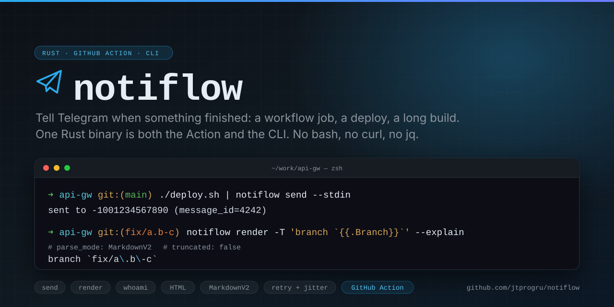

# notiflow

[](https://github.com/jtprogru/notiflow/actions/workflows/ci.yml)
[](https://crates.io/crates/notiflow)
[](https://docs.rs/notiflow)
[](LICENSE)

<p align="center">
  
</p>

Send a Telegram message when something finishes — a workflow job, a deploy script, a long build.

The GitHub Action and the `notiflow` CLI are the same Rust binary, so a template that renders in your workflow renders identically in your terminal. No bash, no `curl`, no `jq`, no Python: one static executable, on Linux, macOS and Windows.

**[Documentation](https://jtprogru.github.io/notiflow/)** · [Getting started](https://jtprogru.github.io/notiflow/getting-started/) · [Migrating from v1](https://jtprogru.github.io/notiflow/action/migration/) · [Документация на русском](https://jtprogru.github.io/notiflow/ru/)

## As a GitHub Action

```yaml
- uses: jtprogru/notiflow@v2
  if: always()
  with:
    bot_token: ${{ secrets.TELEGRAM_BOT_TOKEN }}
    chat_id: ${{ secrets.TELEGRAM_CHAT_ID }}
    status: ${{ job.status }}
```

`if: always()` matters — without it the step is skipped exactly when the job failed, which is when you wanted to hear about it. `status` has to be passed explicitly: a composite action's input defaults cannot read the `job` context.

Full input and output tables are in the [Action reference](https://jtprogru.github.io/notiflow/action/reference/).

## As a CLI

```bash
brew install jtprogru/tap/notiflow     # or: cargo install notiflow

export NOTIFLOW_BOT_TOKEN=123456789:AAHdqTcv...
export NOTIFLOW_CHAT_ID=-1001234567890

notiflow send --message "deploy finished"
./deploy.sh | notiflow send --stdin
notiflow render --template '{{.StatusEmoji}} {{.Repo}} @ {{.ShortSha}}' --explain
notiflow whoami
```

Outside a workflow, `{{.Repo}}`, `{{.Branch}}` and `{{.ShortSha}}` come from the local git checkout, so the same template works in both places.

Release archives are published for seven targets — including static `musl` builds for `alpine` and `scratch` containers — with sha256 checksums, keyless cosign signatures and SLSA build provenance on every release, and detached GPG signatures from `v2.0.0` onward. See [Installation](https://jtprogru.github.io/notiflow/install/) for the signing key and the verification commands.

## What it does for you

Placeholder values are escaped for the active parse mode, so a branch named `fix/a.b-c` cannot inject markup. Messages over Telegram's 4096-unit limit are cut between markup tokens rather than through them, and open HTML tags are closed. Rate limits are honoured, `Retry-After` is read from both the body and the header, backoff carries jitter, and a `4xx` is never retried. The bot token is masked in the workflow log and scrubbed from every stream the binary writes.

A delivery failure exits 0 by default: notiflow's opinion about Telegram should not overwrite the result your build actually produced. Set `fail_on_error` when it should.

## Upgrading from v1

For a workflow that sends to one chat, `@v1` → `@v2` is a drop-in change: same inputs, same outputs, same exit codes 10–16.

The one breaking change is that `chat_id` no longer accepts a comma-separated list — use a job matrix or repeat the step, and you get per-chat outputs and per-chat status instead of a lossy CSV. Everything else that changed is a fix to behaviour that was already broken. All of it is spelled out in the [migration guide](https://jtprogru.github.io/notiflow/action/migration/), and every difference is recorded in a parity corpus that runs both implementations against each other on every commit.

The `v1` tag keeps pointing at the bash implementation on the `v1.x` branch, which receives security fixes only.

## Development

```bash
make build      # the debug binary
make ci         # lint, test, parity, generated-doc check — what CI runs
make help       # everything else
```

No workflow contains a build command of its own; every CI step calls a make target, so a red build is reproducible with one command. See [Contributing](https://jtprogru.github.io/notiflow/contributing/).

## License

MIT — see [LICENSE](LICENSE).
